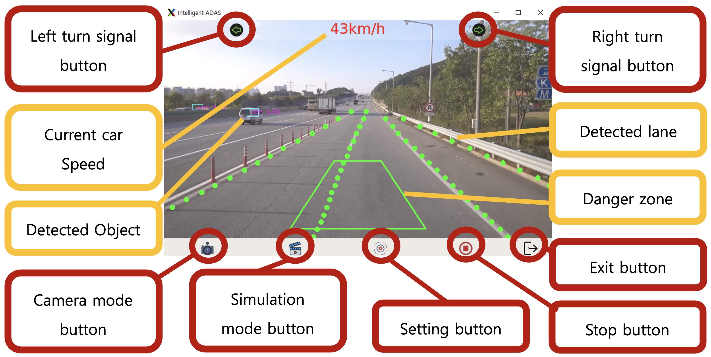

# Advanced driver-assistance systems (ADAS) Program
- **Date**: 2021.06 ~ 2022.02   
- **Tech**: Python, OpenCV, Multi-Threading, PyQT

## Summary
      
- NVIDIA Jetson Series (Xavier, TX, Nano) 환경에서의 ADAS Program 개발 
- Collision Detection, Camera 기능 및 각 Thread 제어 담당

## Result of Project 
- Xavier 기준 Real-Time Application (30 FPS) 달성
- OpenCV 를 이용하여 Brid's Eye View Image 를 구현함으로써 3D 에 본격적 관심을 가지게 됨

## Project Review
- 본격적인 개발자라는 직군에 관심을 가지게된 계기 
- 총 5명으로 구성된 팀에서 협력 개발을 할 수 있었던 경험
- Embedded Device에서의 개발 경험으로 인해 자원이 제한된 환경에서의 구현 중요성이 중요하다는 것을 깨닫는 계기
- 본 프로젝트를 기반으로 C/C++을 이용한다면 좋은 프로젝트로 이어질 수 있다고 생각하여 [자율 주행 시스템 프로젝트](../AutoDog/AutoDog.md)의 동기가 됨

---
[Home](../README.md)