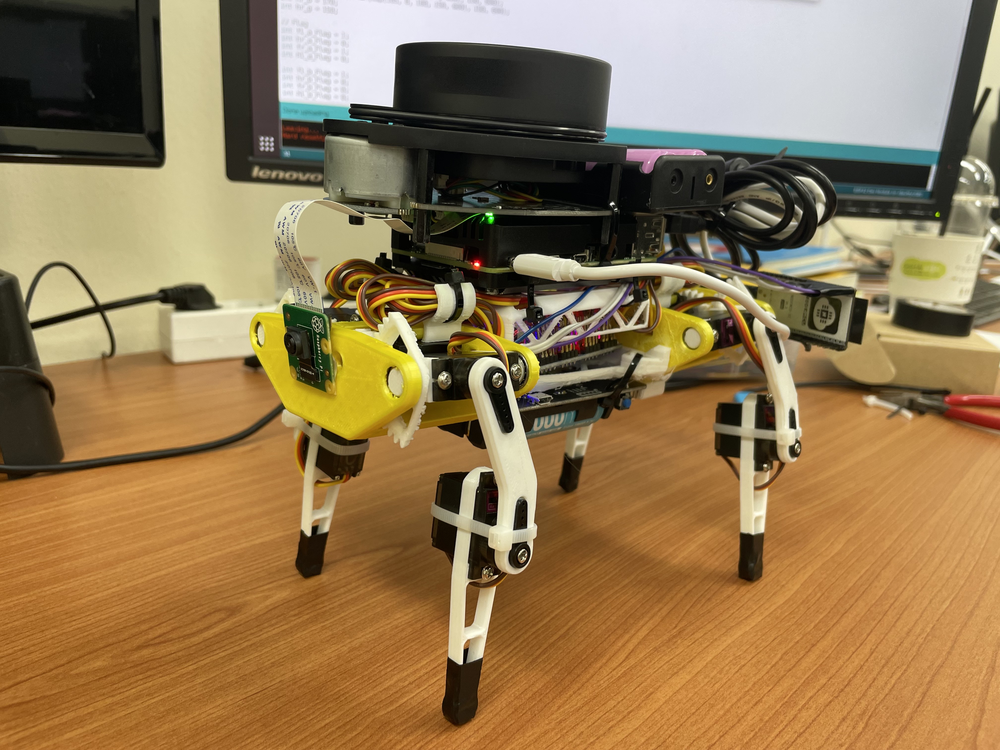
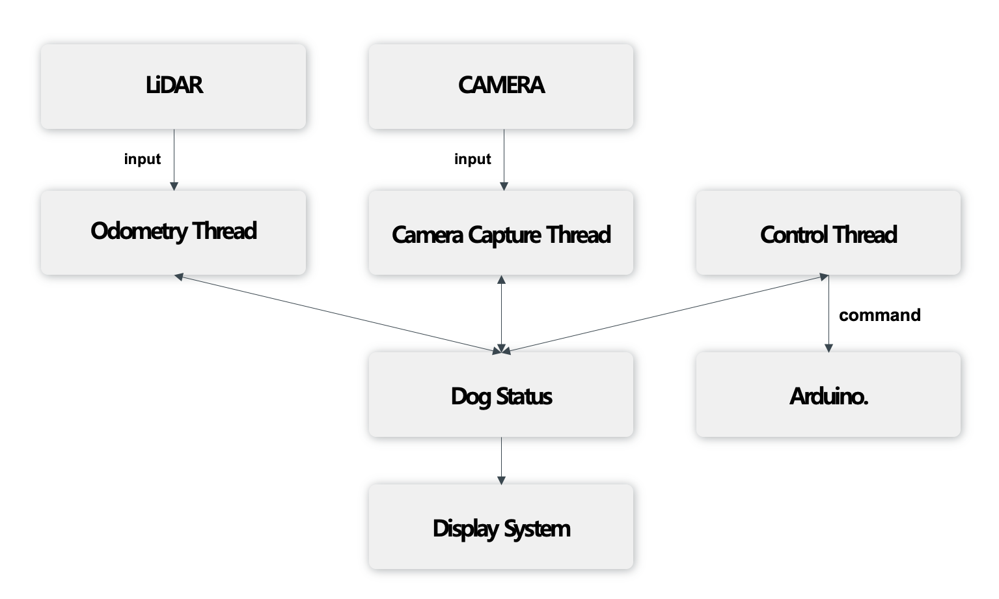

# AutoDog: Auto Driving System by using LiDAR and Camera
- **Date**: 2021.11 ~ 2022.11  
- **Tech**: C/C++, OpenCV, Multi-Threading
- **Reference**: _[(Demo Video)](https://www.youtube.com/watch?v=saTzeXXPWuo)_

## Summary

- Raspberry Pi 4, RPLiDAR A1 그리고 CSI Camera를 이용한 자율 보행 시스템 구축
- LiDAR, Camera, Arduino와 통신 및 모터 제어 등 전반적인 SW 개발 담당 
- 직접 이론들을 공부하며 자율 보행 시스템을 실시간으로 처리하는 것을 목표

## Result of Project 

- 자율 보행 시스템 구축 완료
- 갑작스런 장애물 등장에도 파악 하고 방향 전환 가능
- Display를 통해 LiDAR의 데이터를 확인 가능

## Project Review 
- 아쉬움이 많이 남는 프로젝트
  - 본 프로젝트는 Visual Odometry를 목표로 했었으나, 프로젝트 후반 부 CSI Camera의 잦은 고장으로 인한 LiDAR Odometry로 변경
  - 프로젝트 초기 Jetson Nano로 진행 했지만, 무게 초과 문제로 인해 Rasberry Pi 4로 변경 
  - 시간 부족으로 인한 기능 및 디테일 부족  
- 프로젝트를 아쉽게 마무리 했지만, 많은 것들을 배울 수 있엇던 프로젝트
  - C/C++, CMake를 이용한 첫번째 프로젝트
  - 학부 시절 배웠던 OS, 컴퓨터 구조 등 여러 이론 지식을 활용할 수 있었던 좋은 경험
  - 공개된 자료 및 코드, 3D 프린팅, 전선 연결, LiDAR 연결, 아두이노 연결 등을 이용하여 프로젝트의 시작과 끝을 전부 설계 및 구현 해볼 수 있었던 좋은 경험

---
[Home](../README.md)
