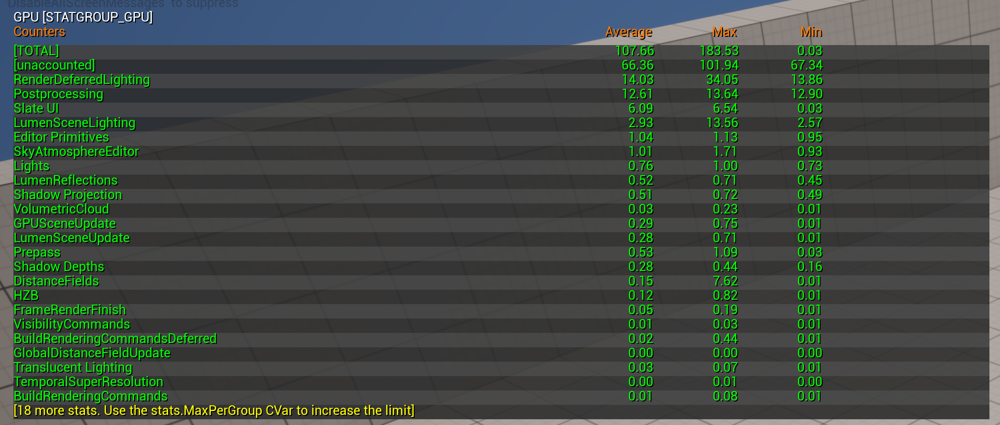
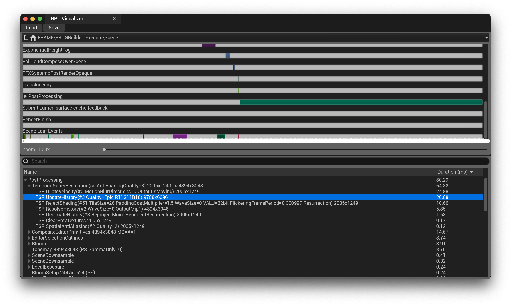

# OptLog2

### 최적화 시작
오늘 최적화를 시작했다. 먼저 새로운 명령어를 찾아서 저번에 찾은 병목현상이 발생하는 부분을 찾야야 했다. 아래와 같은 명령어를 통해 먼저 프로파일링을 진행했다. 

```console 
$ stat unit # 여러가지 정보를 수치로 보여준다.
$ stat unitgraph # unit 의 수치를 그래프로 보여준다. 
$ stat GPU # GPU 에서 오래 걸리는 것을 수치로 보여준다.  
$ ProfileGPU # 어떤 Rendering 기술이 오래걸리는 지 보여준다. 
```

아래의 그림은 stat_GPU의 결과이다. 

이 그림을 확인했을 때 Rendering에 가장 많은 시간을 보내는 것을 확인할 수 있다. 조금 더 자세하게 알기 위해서 ProfileGPU라는 console 명령어를 이용했다. 


이 사진을 분석해봤을 때 Lumen을 이용한 RenderDeferredLighting에 상당한 시간을 쓰는 듯 해 보이지만 그 보다 더한 post processing 에 시간이 매우 많이 소비되는 것을 확인할 수 있다. 가장 오래 걸리는 시간을 가진 기능은 TemporalSuperResolution이다. 

나는 프로젝트를 만들 때 high-quality를 선택해서 수행을 했다. 이것이 원인 일수도 있고 아니면 다른 것이 원인 일수도 있다. 먼저 해당 부분을 최적화 하기 위해서 한번 코드 분석을 들어가보자. (쉽게 하기 위해서는 Anti-Aliasing option을 제거해주면 된다.)

나는 현재 M1 pro 맥북을 사용하고 있는데 이것 저것을 만지다가 Out-of-memory 가 나왔다. 맥북이 버티질 못하는 것 같다. 일단은 저 AA 부분이 문제인 것 같다. 에러 부분에서 MTL이야기가 나왔기 때문에 Metal API 를 쓰는 것은 확실하고 저 부분에 대한 최적화를 진행하자. 

먼저 Anti-Aliasing 부분의 호출이 어떻게 이루어지고 algorithm이 어떻게 수행되는 지를 알아보자.

--- 
[Blog Home](../Blog.md)