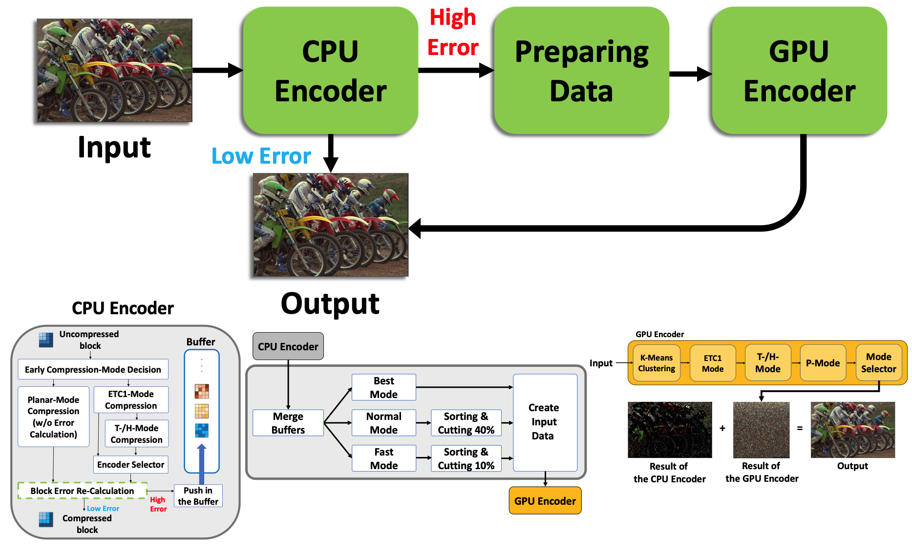
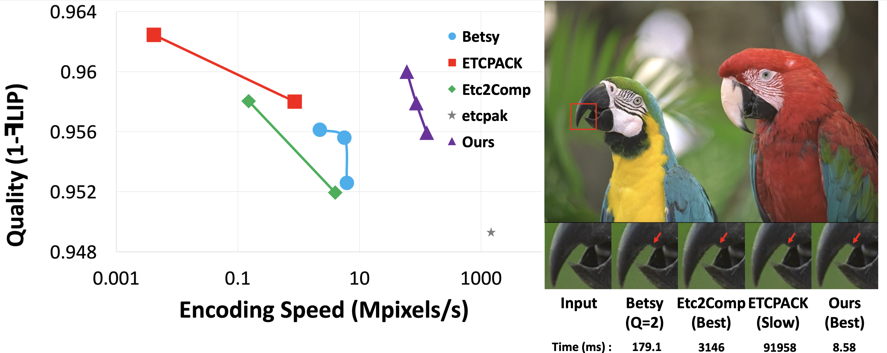

# Hybrid CPU-GPU Texture Compression Methodology
- **Date**: 2022.04 ~ 2023.10  
- **Tech**: C/C++, OpenGL Compute Shader, SIMD (AVX2) intrinsics, Multi-Threading  
- **Reference**: _[(Paper)](https://onlinelibrary.wiley.com/doi/10.1111/cgf.14969?af=R)/[(Code)](https://github.com/gusrlLee/HETC2)_

## Summary
   
- CPU Encoder: 빠른 Encoding Speed를 이용하여 "*Problematic Pixel Blocks*"를 식별
- Pre-processing: GPU Encoder의 Input을 만들기 위해 사용자의 설정에 따른 전처리 작업 ( Fast/Normal/Best Mode )
- GPU Encoder: OpenGL의 Compute Shader를 이용한 Encoding 작업 수행 --> Quality 개선

## Result of Project 

- 기존 공개된 ETC2 Encoder들과 비교하여 Quality와 Encoding Speed 사이의 좋은 Balance를 가짐
- Quality (최대 20% 향상)와 Encoding Speed (최대 10 ~ 1000x) 사이의 Trade-off 개선
- **Computer Graphics 분야 유명 Journal인 Computer Graphics Forum 등재**
- **The 31th Pacific Conference on Computer Graphics and Applications, Pacific Graphics 2023, Program S14. Images, Vectorization and Layouts 참가 및 발표**

## Project Review
- 다양한 Open-Source 들을 이용해볼 수 있었던 좋은 기회
- SIMD, Multi-Threading, GPU, Compute Shader 등 여러 병렬 처리 연산을 경험
- Computer Graphics 분야 유명한 Journal/Conference 에 대한 경험
- 단순 구현이 아닌 최적화의 중요성을 깨달음

---
[Home](../README.md)