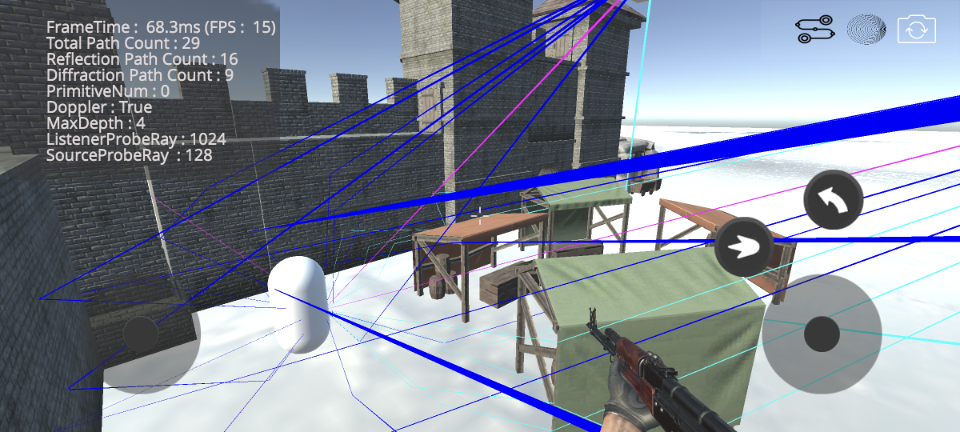
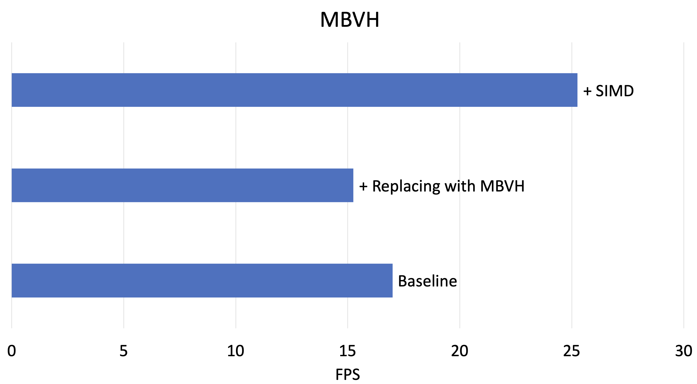

# Multi-Bounding Volume Hierarchy (MBVH) for Sound Propagation
- **Date**: 2023.08 ~ 2024.04  
- **Tech**: C/C++, SIMD (ARM NEON) intrinsics, Multi-Threading  
- **Reference**: _[(Demo Video)](https://www.youtube.com/watch?v=Jvjt7jii3Dc)_

## Summary
  
- Ray Tracing method 를 사용하는 Geometry-Acoustics (GA) 기반의 Sound Propagation 가속을 위한 Acceleration Structure 비교 실험 연구 (kd-tree & MBVH)
- [Kim et al. 2023](https://www.mdpi.com/1424-8220/23/2/973) 을 기반으로 [Ernst and Greiner 2008](https://ieeexplore.ieee.org/document/4634618) 참고하여 MBVH를 구현 담당
- ARM NEON SIMD Intrinsics 을 이용한 Ray Traversal & Triangle Intersection Test (T & I) Step 최적화 진행

## Result of Project

- Baseline과 비교하여 20 ~ 30%의 성능 개선 
- Bounding Box의 Overlap, Compactness 문제를 직면 

## Project Review
- 관심이 있던 Ray Tracing 의 Acceleration Structure로 사용되는 MBVH를 직접 구현하고 최적화 진행 경험 획득
- SIMD Programming의 숙련도 증가
- 자원이 제한된 모바일 환경에서의 개발 경험

---
[Home](../README.md)