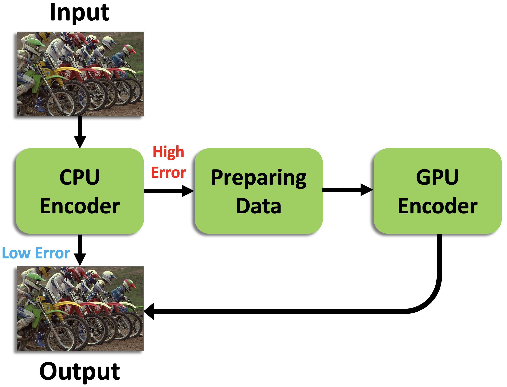
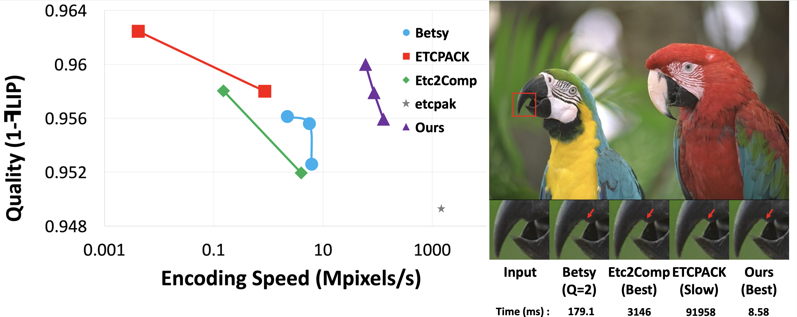
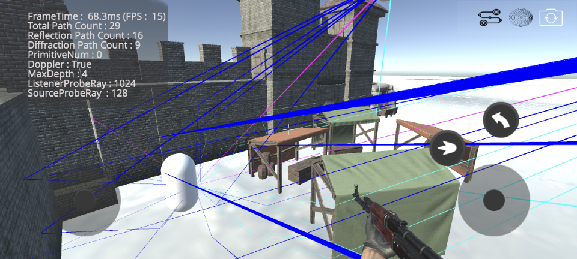
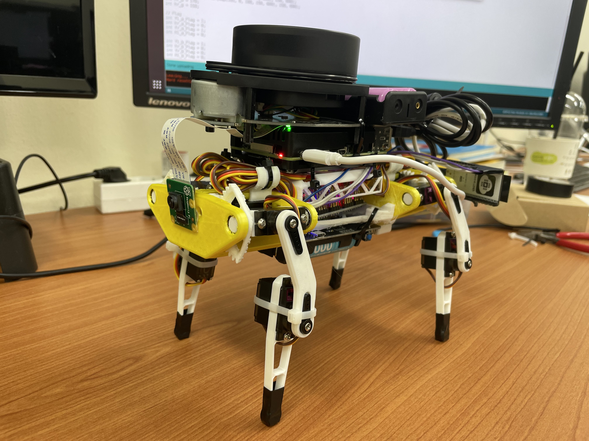
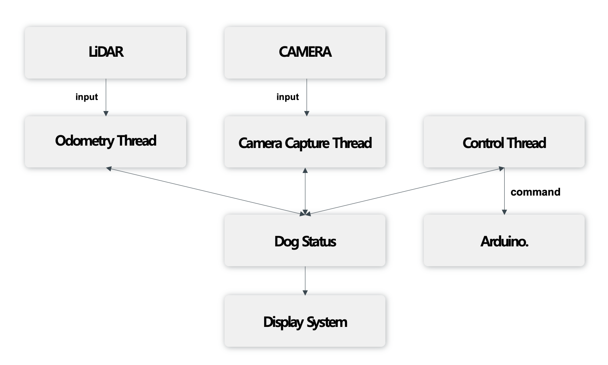
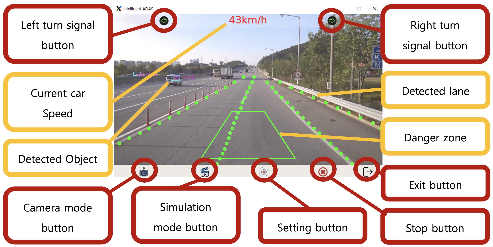

# Hyeon-ki Lee
**Keywords**: Ray/Path Tracing, Real-Time Rendering, Texture Compression, Image Processing   
**Objective**: Develop or research Real-Time Applications such as Rendering, Image processing, and Ray/Path Tracing by utilizing CPU (Multi-threading, AVX/NEON SIMD Intrinsic) and GPU (Graphics API, GPGPU).

## Projects
|H-ETC2 System Overview| Performance |
|   :-:     |   :-:      |
|      |  |
### **H-ETC2 : Design of a CPU-GPU Hybrid ETC2 Encoder**    
#### Summary    
- 개요: CPU와 GPU를 활용하는 Hybrid ETC2 Encoding Pipeline 구축
- 담당: 전반적인 Ecnoding Pipeline 구현 및 실험

#### Details    
- 빠른 속도와 좋은 품질을 위해 OpenGL의 Compute Shader와 Multi-Threading, AVX2 SIMD Intrinsic 사용
- CPU Encoder 에서는 *"Problematic Pixel Block"* 을 판단을 하며 빠른 Encoding 진행
- 판단 된 *"Problematic Pixel Block"* 들은 GPU Encoder 의 input으로 전처리
- 생성 된 input image는 GPU Encoder 에 의해 Encoding 된 후 최종 Texture Compression 을 마무리
- Encoding Quality 측면 최대 20% 향상, Encoding Speed 측면 최대 100 ~ 1000% 향상

---
  
 

      
### **Multi-Bounding Volume Hierarchy (MBVH) for Sound Propagation**    
#### Summary
- 개요: Ray Tracing method 를 사용하는 Geometry-Acoustics (GA) 기반의 Sound Propagation 가속을 위한 Acceleration Structure 비교 실험
- 담당: Ray Tracing 의 Acceleration Structure 로 사용되는 Multi Bounding Volume Hierarchies (MBVH) 구현 및 실험

#### Details
- [Kim et al. 2023](https://www.mdpi.com/1424-8220/23/2/973) 을 기반으로 [Ernst and Greiner 2008](https://ieeexplore.ieee.org/document/4634618) 참고하여 MBVH를 적용
- ARM NEON Intrinsic 을 이용한 Ray Traversal & Intersection test (T & I) step 최적화 진행
- Baseline 과 비교하여 20~30% 의 성능 향상  

---
 
 

|AUTODOG H/W|AUTODO S/W|
|   :-:     |   :-:    |
||  |   
### **AutoDog**
#### Summary
- 개요: Raspberry Pi4, RPLiDAR A1 그리고 CSI Camera 를 이용한 자율 보행 시스템 구축
- 담당: LiDAR, Camera, Arduino와 통신 및 제어 등 전반적인 SW 개발 담당

#### Details
- C/C++, CMake, OpenCV (C++) 를 학습하기 위한 자행 보행 프로젝트 [(Demo Video)](https://youtu.be/saTzeXXPWuo)
- Jetson Nano, Arduino, Raspberry Pi 3/4 등 여러 Embedded device 와 같이 자원이 제한된 환경에서의 개발 경험 습득

---
  
 

      
### **ADAS Program**
#### Summary
- 개요: NVIDIA Jetson Nano 환경에서 ADAS program 개발 및 최적화 프로젝트
- 담당: Collision Detection 기능과 각 Thread 제어 담당

#### Details
- Python 을 이용하여 Real-Time Application (30 FPS) 의 성능을 이룸
- OpenCV 를 이용하여 Brid's Eye View Image 를 구현함으로써 3D 에 본격적 관심을 가지게 됨

## Publications
1. **Hyeon-ki Lee** and Jae-Ho Nah, "H-ETC2: Design of a CPU-GPU Hybrid ETC2 Encoder", Computer Graphics Forum (Special Issue of Pacific Graphics 2023), 42(7), 2023, [(Link)](https://onlinelibrary.wiley.com/doi/10.1111/cgf.14969?af=R), [(Code)](https://github.com/gusrlLee/HETC2)
2. **Hyeon-ki Lee**, Hyeju Kim, Dong-Yun Kim, Woo-Chan Park and Jae-Ho Nah, "Considerations for the Acceleration Structure of Sound Propagation on Embedded Devices: Kd-trees versus Multi Bounding Volume Hierarchies", Multimedia Tools and Applications, 2024 (Under review), [(Demo)]()

## Education
- M.S., Computer Scienece	 | Sangmyung University, Seoul, Korea ( _2023.03 ~ 2024.08_ )			        		
- B.S., Electric Engineering | Sangmyung University, Seoul, Korea ( _2017.03 ~ 2023.02_ )

## Experience
- GPU Tech Labs @ Sanmyung University, Seoul, Korea ( _2022.04 ~ 2024.08_ )
- Creative Contents Labs @ Sanmyung University, Seoul, Korea ( _2021.04 ~ 2022.03_ )